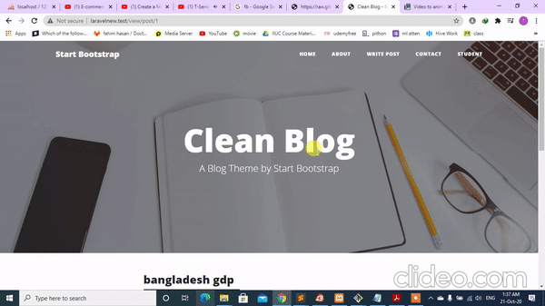

## About Laravel blog
 
 
 
 
Laravel is a web application framework with expressive, elegant syntax. We believe development must be an enjoyable and creative experience to be truly fulfilling. Laravel takes the pain out of development by easing common tasks used in many web projects, such as:

1. Clone the repo and `cd` into it
1. `composer install`
1. Rename or copy `.env.example` file to `.env`
1. `php artisan key:generate`
1. Set your database credentials in your `.env` file

Laravel is accessible, powerful, and provides tools required for large, robust applications.

